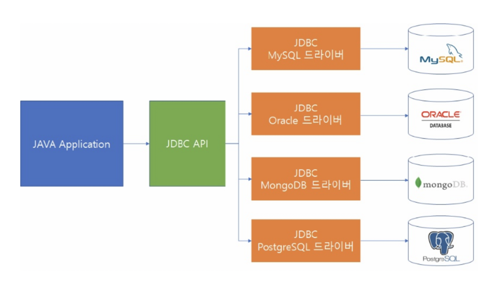

# OCP - 개방 폐쇄 원칙

> S**O**LID
>
> "소프트웨어 엔티티(클래스, 모듈, 함수 등)는 확장에 대해서는 열려있어야 하지만, 변경에 대해서는 닫혀있어야 한다." - 로버트 C.마틴
>
> = "자신의 확장에는 열려있고, 주변의 변화에 대해서는 닫혀 있어야 한다."

개방 폐쇄를 가장 잘 나타낼 수 있는 것이 **JDBC**이다.

**자바 애플리케이션** ←→ **JDBC 인터페이스** ←→ **JDBC 드라이버 (오라클, MySQL, MS-SQL)**

위와 같은 관게를 갖고있는데

**JDBC 인터페이스** 입장에서 생각했을 때 **JDBC 인터페이스**의 확장에는 **'개방'**적이고

**자바 애플리케이션** 입장에서 생각했을 때 주변의 변화(DB의 변화)에 **'폐쇄'**적이라고 표현할 수 있다.

내가 오라클을 DB로 사용하다가 MySQL로 바꾸게 되는 상황을 가정해보자.

만약 위와같은 구조가 아니라 **JDBC 인터페이스**가 중간에 없었다면 **자바 어플리케이션**의 코드를 대폭 수정하는 상황이 발생할 수도 있다.

하지만 **JDBC 인터페이스**가 중간에 있으므로 Connection 부분만 코드를 조금 수정하면 무리없이 DB의 변경이 가능하다.

**개방 폐쇄의 원리**를 적용하지 않으면 **유연성**, **재사용성**, **유지보수성** 등 객체 지향 프로그래밍의 장점들을 활용할 수 없다.

***따라서 개방 폐쇄 원칙은 객체 지향 프로그래밍에서 반드시 지켜야할 원칙이다!***