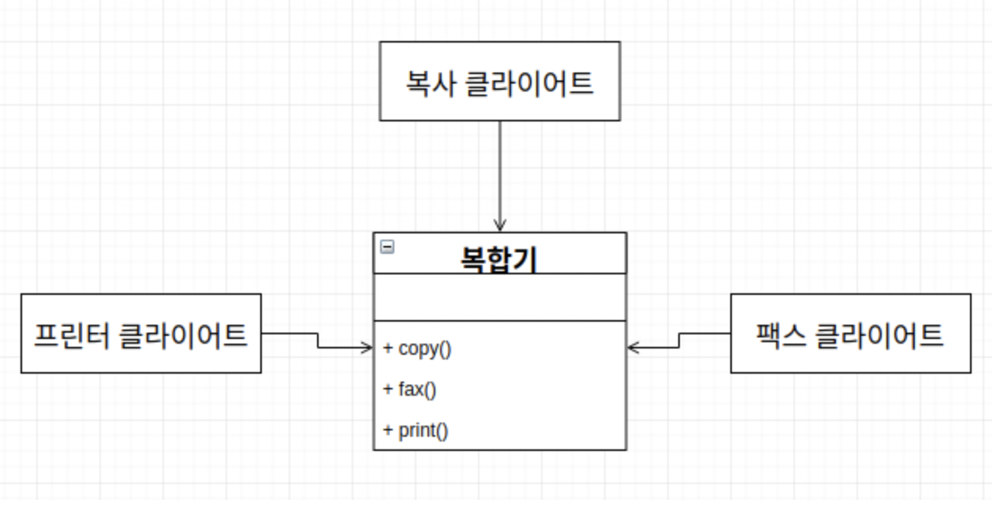
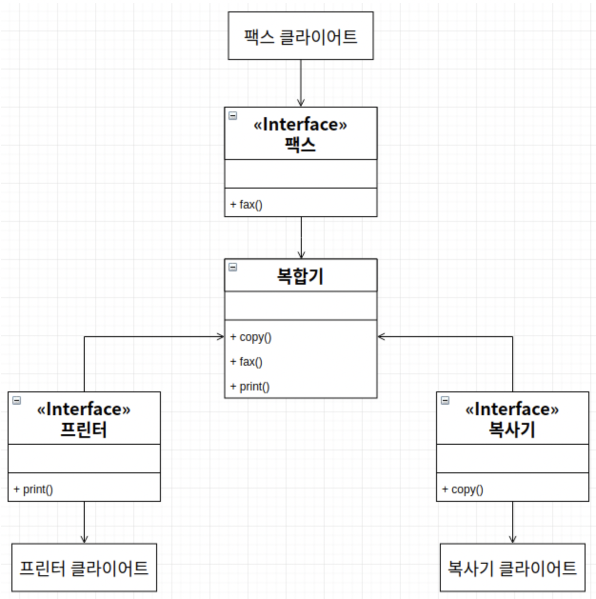

# ISP - 인터페이스 분리 원칙

> SOL**I**D
>
> "클라이언트는 자신이 사용하지 않는 메서드에 의존 관계를 맺으면 안된다." - 로버트 C.마틴

> 출처 : https://walbatrossw.github.io/oop/2018/07/27/07-solid-isp.html

> 출처 : https://walbatrossw.github.io/oop/2018/07/27/07-solid-isp.html

위 그림을 아래와 같이 구성하는 것이 인터페이스 분리 원칙이다.

보면 **SRP**(단일 책임 원칙)과 굉장히 흡사해 보인다. 

**SRP**와 **ISP**는 같은 문제에 대한 두가지 해결책 이라고 생각하면 된다.

**ISP**와 함께 등장하는 것이 **인터페이스 최소주의 원칙** ( 인터페이스를 통해 메서드를 외부에 제공할 때는 최소한의 메서드만 제공하라는 것) 이다.

상위 클래스는 풍성할수록 좋고, 인터페이스는 작을수록 좋다.