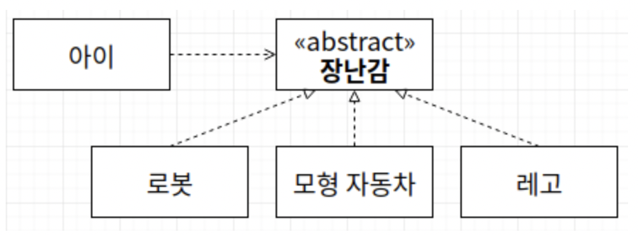

# DIP - 의존 역전 원칙

> SOLI**D**
>
> "고차원 모듈은 저차원 모듈에 의존하면 안된다. 이 두 모듈 모두 다른 추상화된 것에 의존해야 한다."
>
> "추상화된 것은 구체적인 것에 의존하면 안된다. 구체적인 것이 추상화된 것에 의존해야 한다."
>
> "자주 변경되는 구체(Concrete)를 클래스에 의존하지 마라" - 로버트 C.마틴

> 출처: https://walbatrossw.github.io/oop/2018/07/27/06-solid-dip.html

만약 **아이**가 **로봇**에 직접적으로 의존하고 있었다면, 아이가 로봇이 아닌 **모형자동차**를 가지고 놀 때 **아이**라는 클래스가 영향을 받는다.

**아이**보다 자주 변경되는 구체(Concrete)인 **로봇**을 클래스에 의존시켰기 때문이다.

이를 위 사진처럼 바꾼다면 이것은 의존 역전의 원칙을 잘 지키고 있는 것이다.

***"자신보다 변하기 쉬운 것에 의존하지 마라."***

변하지 않을 가능성 높음 : 상위 클래스, 인터페이스, 추상 클래스

변할 가능성 높음 : 하위 클래스, 구체 클래스