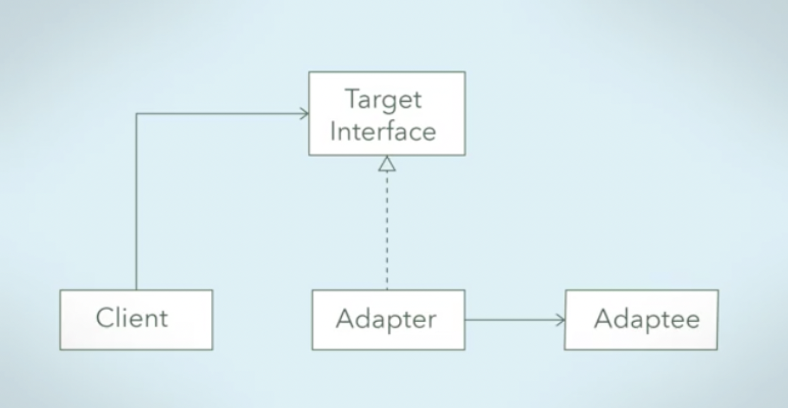
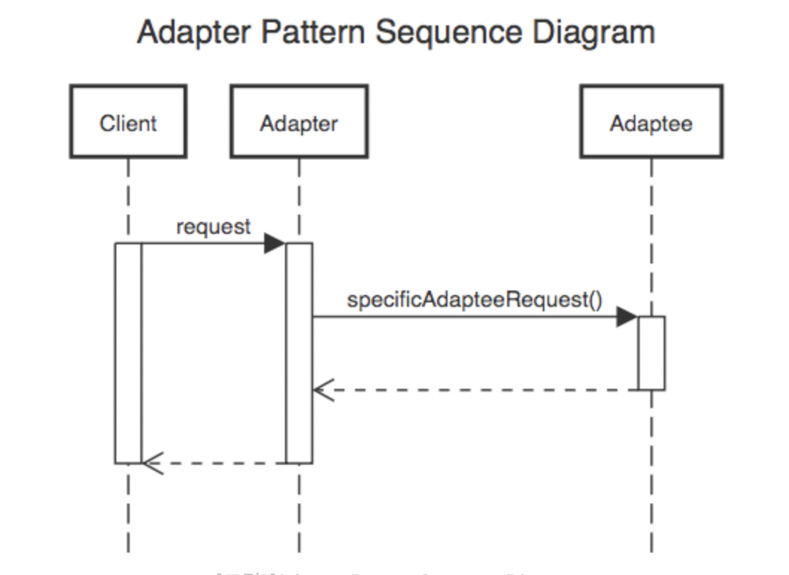

# 어뎁터 패턴 (Adapter Pattern)

> OCP(개방 폐쇄 원칙)을 활용한 설계 패턴


### ***<u>"호출 당하는 쪽의 메서드를, 호출하는 쪽의 코드에 대응하도록 중간에 변환기를 통해 호출하는 패턴"</u>***


어뎁터는 변환기라고 직역할 수 있다.

변환기는 **서로 다른 두 인터페이스 사이에 통신이 가능하게 하는** 역할을 한다. (ex. JDBC, JRE)




> 출처: https://yaboong.github.io/design-pattern/2018/10/15/adapter-pattern/



> 출처: https://yaboong.github.io/design-pattern/2018/10/15/adapter-pattern/ 


- Adaptee 를 감싸고, Target Interface 만을 클라이언트에게 드러낸다.
- Target Interface 를 구현하여 클라이언트가 예상하는 인터페이스가 되도록 Adaptee 의 인터페이스를 간접적으로 변경한다.
- Adaptee 가 기대하는 방식으로 클라이언트의 요청을 간접적으로 변경한다.
- 호환되지 않는 우리의 인터페이스와 Adaptee 를 함께 사용할 수 있다.


## 예시

- **어뎁터 패턴을 적용하지 않은 예시**

```java
public class ServiceA {
  void runServiceA(){
    System.out.println("Service A");
  }
}
```

```java
public class ServiceB {
  void runServiceB(){
    System.out.println("Service B");
  }
}
```

```java
public class RunService {
  ServiceA sa = new ServiceA();
  ServiceB sb = new ServiceB();
  
  sa.runServiceA();
  sb.runServiceB();
}
```

> 출력 결과:
>
> Service A
>
> Service B


- **어뎁터 패턴을 적용한 예시**

*(Adaptee)*

```java
package adaptee;

public class ServiceA {
    public void runServiceA(){
        System.out.println("Service A");
    }
}
```

```java
package adaptee;

public class ServiceB {
    public void runServiceB(){
        System.out.println("Service B");
    }
}
```

*(Target Interface)*

```java
package adapter;

public interface AdapterInterface {
    void runservice();
}
```

*(Adapter)*

```java
package adapter;

import adaptee.ServiceA;

public class AdapterServiceA implements AdapterInterface{
    private ServiceA serviceA;

    public AdapterServiceA(ServiceA serviceA) {
        this.serviceA = serviceA;
    }

    @Override
    public void runservice() {
        serviceA.runServiceA();
    }
}
```

```java
package adapter;

import adaptee.ServiceB;

public class AdapterServiceB implements AdapterInterface{
    private ServiceB serviceB;

    public AdapterServiceB(ServiceB serviceB) {
        this.serviceB = serviceB;
    }

    @Override
    public void runservice() {
        serviceB.runServiceB();
    }
}
```

*(Client)*

```java
package client;


import adapter.AdapterInterface;

public class Client {
    private AdapterInterface adapterInterface;

    public Client(AdapterInterface adapterInterface) {
        this.adapterInterface = adapterInterface;
    }

    public void doWork(){
        adapterInterface.runservice();
    }
}
```

*(Run)*

```java
import adaptee.ServiceA;
import adaptee.ServiceB;
import adapter.AdapterInterface;
import adapter.AdapterServiceA;
import adapter.AdapterServiceB;
import client.Client;

public class RunService {
    public static void main(String[] args) {
        AdapterInterface adapterA = new AdapterServiceA(new ServiceA());
        AdapterInterface adapterB = new AdapterServiceB(new ServiceB());

        Client clientA = new Client(adapterA);
        Client clientB = new Client(adapterB);

        clientA.doWork();
        clientB.doWork();
    }
}
```

> 출력 결과:
>
> Service A
>
> Service B


구조를 위와 같이 바꾸면 나중에 **Adpatee** 를 다른 클래스(또는 인터페이스) 로 바꾸어야 할 일이 생겼을 때, 

**Client 의 메서드나 코드를 전혀 수정할 필요 없이** 어뎁터패턴을 사용해 새로운 클래스로 연결해주면 문제 없이 로직이 돌아가게 된다. 

유지 보수 매우 수월!


### 


