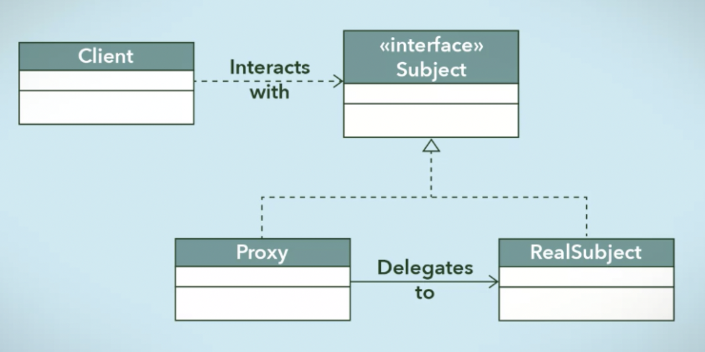

# 프록시 패턴 (Proxy Pattern)

> OCP(개방 폐쇄 원칙) & DIP(의존 역전 원칙) 을 활용한 설계 패턴


### ***<u>"제어 흐름을 조정하기 위한 목적으로 중간에 대리자를 두는 패턴"</u>***


**프록시**는 **대리자**, **대변인** 으로 직역할 수 있다.

프록시 패턴은 실제 서비스읭 메서드의 반환 값에 가감하는 것을 목적으로 하지 않고,

**제어의 흐름을 변경하거나, 다른 로직을 수행하기 위해 사용한다.**



> 출처: https://yaboong.github.io/design-pattern/2018/10/17/proxy-pattern/


- Polymorphism(다형성)을 가지도록 디자인함으로써 클라이언트가 하나의 인터페이스 접근할 수 있다.

- 리소스 집약적인 객체가 실제로 필요해질 때까지 라이트한 버전의 프록시 클래스로 전처리 등 필요한 작업을 진행할 수 있다.

  >  **Virtual Proxy**

- 클라이언트가 주체 클래스에 접근하는 것에 대한 제한이나 어떤 클라이언트인지에 따라 서로 다른 방식으로 요청이 처리되도록 할 수 있다. 

  > **Protection Proxy**

- 동일한 물리적 또는 가상 공간에 있지 않은 시스템을 로컬에 있는 것 처럼 표현할 수 있다. 

  >  **Remote Proxy**


## 예시

*(IService)*

```java
package work;

public interface IService {
    String runSomething();
}
```

*(Proxy)*

```java
package work;

public class Proxy implements IService{
    IService service;
    
  	@Override
    public String runSomething() {
        checkSomething();
        service = new Service();
        return service.runSomething();
    }

    private void checkSomething(){
        System.out.println("Check Something...");
    }
}
```

*(Service)*

```java
package work;

public class Service implements IService{
    @Override
    public String runSomething() {
        return "Hi there!";
    }
}
```

*(Client)*

```java
package client;

import work.IService;
import work.Proxy;

public class Client {
    public static void main(String[] args) {
        IService proxy = new Proxy();
        System.out.println(proxy.runSomething());
    }
}
```

> 출력 결과:
>
> Check Something...
>
> Hi there!


### 

