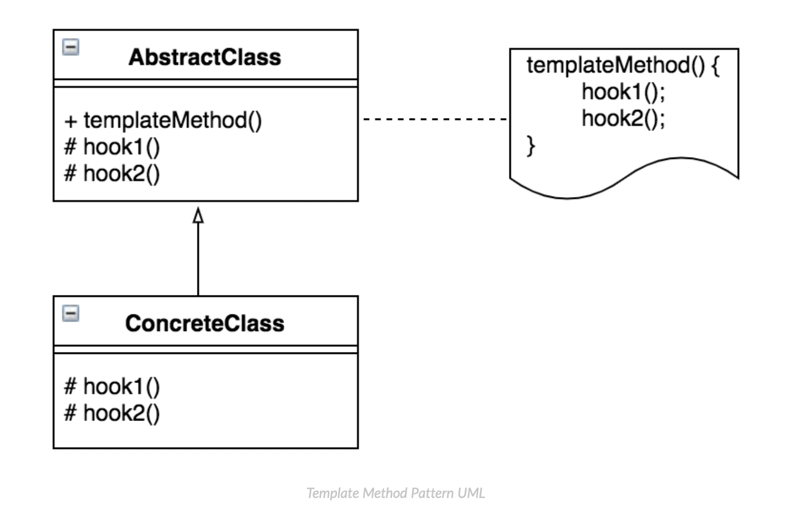

# 템플릿 메서드 패턴 (Template Method Pattern)

> DIP(의존 역전 원칙) 을 활용한 설계 패턴


### ***<u>"상위 클래스의 견본(템플릿) 메서드에서  하위 클래스가 오버라이딩한 메서드를 호출하는 패턴"</u>***


**템플릿 메서드 패턴이란**

상위 클래스에 **공통 로직을 수행하는 템플릿 메서드**와

하위 클래스에 **오버라이딩을 강제하는 추상 메서드** 또는

**선택적으로 오버라이딩 할 수 있는 훅(Hook) 메서드**를 두는 패턴을 말한다.




> 출처: https://yaboong.github.io/design-pattern/2018/09/27/template-method-pattern/ 


***상속을 통해 슈퍼클래스의 기능을 확장할 때 사용하는 가장 대표적인 방법.*** 

***변하지 않는 기능은 슈퍼클래스에 만들어두고 자주 변경되며 확장할 기능은 서브클래스에서 만들도록 한다.*** 

> 출처: 토비의 스프링 3.1 (https://yaboong.github.io/design-pattern/2018/09/27/template-method-pattern/ 에서 참고)


## 예시

*(Autobot)*

```java
package autobot;

public abstract class Autobot {
    // 템플릿 메서드
    public void goOut(){
        System.out.println("Let's roll!");
        transform();
        honkHorn();
        System.out.println("Kill them all!!");
    }

    // 추상 메서드
    public abstract void transform();

    // Hook 메서드
    public void honkHorn (){
        System.out.println("Bang Bang!");
    }
}
```

*(Prime)*

```java
package autobot;

public class Prime extends Autobot{
    @Override
    public void transform() {
        System.out.println("I'm Optimus Prime!");
    }
}
```

*(Bumblebee)*

```java
package autobot;

public class Bumblebee extends Autobot{
    @Override
    public void transform() {
        System.out.println("@##$#@#!@@#");
    }

    @Override
    public void honkHorn (){
        System.out.println("!!!!!@#$@#!!!!");
    }
}
```

*(Client)*

```java
package client;

import autobot.Autobot;
import autobot.Bumblebee;
import autobot.Prime;

public class Client {
    public static void main(String[] args) {
        Autobot prime = new Prime();
        Autobot bumblebee = new Bumblebee();

        prime.goOut();

        System.out.println();
        System.out.println();

        bumblebee.goOut();

    }
}
```

> 출력 결과: 
>
> Let's roll!
> I'm Optimus Prime!
> Bang Bang!
> Kill them all!!
>
> 
>
> Let's roll!
> @##$#@#!@@#
> !!!!!@#$@#!!!!
> Kill them all!!


