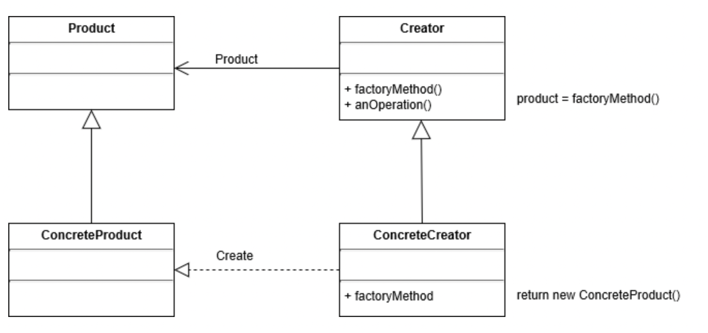

# 팩토리 메서드 패턴 (Factory Method Pattern)

> DIP(의존 역전 원칙) 을 활용한 설계 패턴


### ***<u>"오버라이드된 메서드가 객체를 반환하는 패턴"</u>***


팩토리를 직역하면 **공장**이다. 객체지향에서 공장은 **객체를 생성**한다.

간단하게 생각해서 템플릿 메서드 패턴에서 **객체를 반환**하면 팩토리 메서드 패턴이다.




> 출처: https://www.crocus.co.kr/1543


##  예시

*(Creator)*

```java
package autobot;

import weapon.Weapon;

public abstract class Autobot {
    // 템플릿 메서드
    public void goOut(){
        System.out.println("Let's roll!");
        transform();
        honkHorn();
        System.out.println("Kill them all!!");
    }

    // 추상 메서드
    public abstract void transform();

    // Hook 메서드
    public void honkHorn (){
        System.out.println("Bang Bang!");
    }

    // 추상 팩토리 메서드
    public abstract Weapon getWeapon();
}
```

*(ContreteCreator)*

```java
package autobot;

import weapon.Sword;
import weapon.Weapon;

public class Prime extends Autobot{
    @Override
    public void transform() {
        System.out.println("I'm Optimus Prime!");
    }

    @Override
    public Weapon getWeapon() {
        return new Sword();
    }
}
```

*(Product)*

```java
package weapon;

// 팩토리 메서드가 생성할 객체의 상위 클래스
public abstract class Weapon {
    public abstract void identify();
}
```

*(ConcreteProduct)*

```java
package weapon;

public class Sword extends Weapon{
    @Override
    public void identify() {
        System.out.println("Slash!");
    }
}
```

*(Client)*

```java
package client;

import autobot.Autobot;
import autobot.Prime;
import weapon.Weapon;

public class Client {
    public static void main(String[] args) {
        // 팩토리 메서드를 보유한 객체 생성
        Autobot prime = new Prime();

        // 팩토리 메서드가 반환하는 객체
        Weapon weapon = prime.getWeapon();

        weapon.identify();

    }
}
```

> 출력 결과:
>
> Slash!


이를 통해 **메인 프로그램에서는 어떤 객체가 생성되었는지 신경 쓸 필요 없이** 

반환된 객체만 사용하면 되고 Weapon 클래스에서 변경이 발생해도 **메인 프로그램이 변경되는 것은 최소화**할 수 있다.