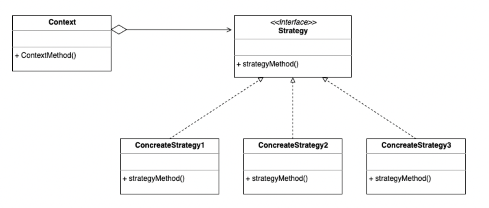

# 전략 패턴 (Strategy Pattern)

> OCP(개방 폐쇄 원칙) & DIP(의존 역전 원칙) 을 활용한 설계 패턴


### ***<u>"클라이언트가 전략을 생성해 전략을 실행할 컨텍스트에 주입하는 패턴"</u>***




**전략 패턴을 구성하는 세 요소**

- 전략 메서드를 가진 객체
- 전략 객체를 사용하는 컨택스트 (전략 객체의 사용자/소비자)
- 전략 객체를 생성해 컨텍스트에 주입하는 클라이언트 (제3자, 전략 객체의 공급자)


## 예시

*(Strategy)*

```java
package strategy;

public interface Coffee {
    public abstract void makeCoffee();
}
```

*(ConcreateStrategy1)*

```java
package strategy;

public class Americano implements Coffee{
    @Override
    public void makeCoffee() {
        System.out.println("Water + espresso");
    }
}
```

*(ConcreateStrategy2)*

```java
package strategy;

public class Latte implements Coffee{
    @Override
    public void makeCoffee() {
        System.out.println("Milk + espresso");
    }
}
```

(Context)

```java
package context;

import strategy.Coffee;

public class Cafe {
    public void work(Coffee coffee){
        System.out.println("Welcome!");
        coffee.makeCoffee();
        System.out.println("See you!");
    }
}
```

(Client)

```java
package client;

import context.Cafe;
import strategy.Americano;
import strategy.Coffee;
import strategy.Latte;

public class Client {
    public static void main(String[] args) {
        Coffee coffee = null;
        Cafe cafe = new Cafe();

        // 아메리카노 주세요
        coffee=new Americano();
        cafe.work(coffee);

        System.out.println();

        // 라떼 주세요
        coffee = new Latte();
        cafe.work(coffee);
    }
}
```

> 출력 결과:
>
> Welcome!
> Water + espresso
> See you!
>
> 
>
> Welcome!
> Milk + espresso
> See you!


**전략 패턴**은 다양한 곳에서 **다양한 문제 상황의 해결책**으로 사용된다.

탬플릿 메서드 패턴과 굉장히 유사한 형태를 띄며, 같은 문제의 해결책으로 

**상속**을 이용하는 **템플릿 메서드 패턴**과

**객체 주입**을 통한 **전략 패턴** 중에서 선택/적용 할 수 있다.

(단일 상속만을 허용하는 자바에서는 상속이라는 제한이 있는 템플릿 메서드 패턴 보다는 전략패턴이 더 많이 활용된다.)